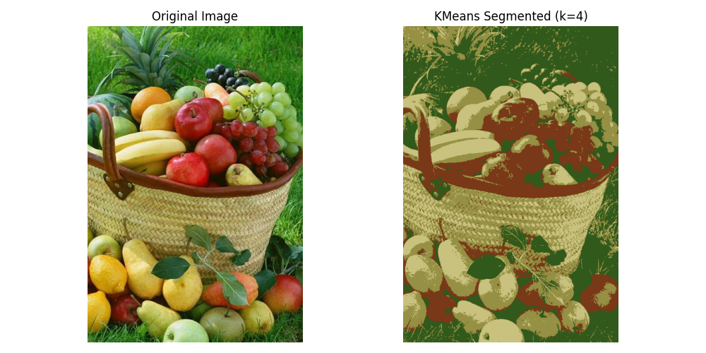

# 🖼️ Task 2: Image Compression using K-Means Clustering

## 📌 Objective

This task demonstrates how **K-Means clustering** can be used for **image compression** by reducing the number of colors in an image without significantly degrading visual quality.

---

## 📊 Problem Statement

Given a full-color image, we aim to:

- Compress the image by clustering pixel RGB values using **K-Means**.
- Reduce the number of colors in the image while preserving perceptual quality.
- Observe how varying the number of clusters (`k`) impacts the compression level and visual output.

---

## 🛠️ Technologies Used

- Python 3.8+
- `numpy`, `matplotlib`, `Pillow`
- `scikit-learn`

---

## 🧪 Algorithm Overview

### 🔹 K-Means for Image Compression
- Treat each pixel as a point in 3D RGB space.
- Apply K-Means clustering to group similar colors.
- Replace each pixel's color with its cluster centroid.
- Lower `k` results in higher compression but more loss.

---

## 📁 Files Included

```text
Task2/
├── IMG2.jpg           # Original source image
├── Task2.py           # Script to perform image compression
├── Kmeans.png         # Output with k=4
├── K100.png           # Output with k=100
├── K1000.png          # Output with k=1000
└── README.md          # This file
```
---

---

## 🖼️ Sample Output

### 🖼️ Original Image


### 🔻 Compression Results at Different k Values

| k = 4 | k = 100 | k = 1000 |
|------|---------|----------|
|  |  |  |

> 💡 As `k` increases, the output image quality improves but with less compression.

---

## 📚 Key Learnings

- K-Means can efficiently reduce image file sizes by clustering color space.
- Small values of `k` may distort color details, while higher values preserve quality.
- This approach is useful for lossy compression, texture reduction, and stylized effects.

---

## ▶️ How to Run

Make sure you have the required packages:

```bash
pip install numpy matplotlib scikit-learn pillow
```
Then, run the script:

```bash
python Task2/image_compression.py
```
You can modify the k value in the script to try different compression levels.
---
